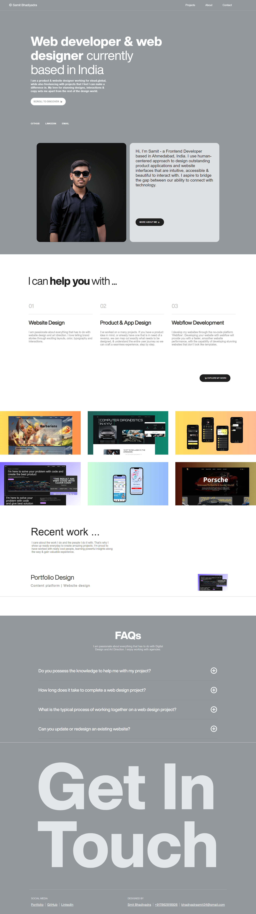

# My Portfolio

This is a My Portfolio to showcase my Previous works & which services are provided by me...

## 🚀 About Me
🔭 I’m currently working on Netflix Clone

🌱 I’m currently learning Backen

👨‍💻 All of my projects are available at https://linktr.ee/smit_bhadiyadra

💬 Ask me about gsap, frontend development

📫 How to reach me bhadiyadrasmit24@gmail.com

⚡ Fun fact I love to coding and develop new things 😎

## 🔗 Links

## 🛠 Skills
Javascript, HTML, CSS, Python, Java, C Programming, Figma...

## Support

For support, email bhadiyadrasmit24@gmail.com

## Screenshots

## Related

Here are some related projects

[Portfolio-Design](https://smitbhadiyadra.github.io/Resume-Design/)

# Smit Bhadiyadra

## Author

- [@smitbhadiyadra](https://github.com/smitbhadiyadra)

